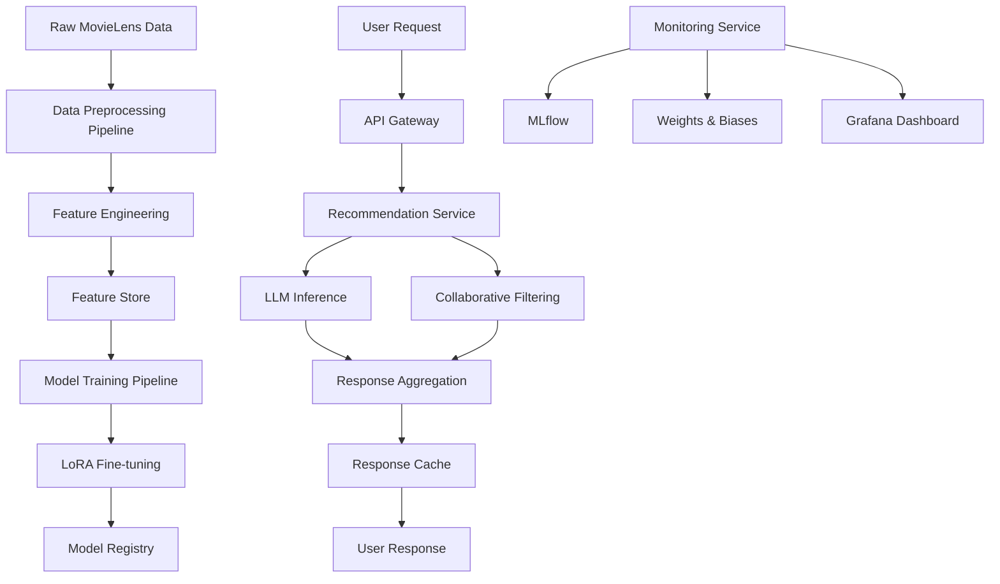

# Architecture Overview

## System Architecture

This document outlines the high-level architecture of our LLM-based movie recommendation system, designed for scalability, maintainability, and production readiness.

## Core Components

### 1. Data Layer
- **Dataset**: MovieLens 25M dataset with ratings, movies, tags, and user data
- **Storage**: PostgreSQL for structured data, Redis for caching
- **Feature Store**: Feast for feature management and serving

### 2. Model Layer
- **Base Model**: Ollama-hosted LLM (Llama 2/3 or Mistral)
- **Fine-tuning**: LoRA (Low-Rank Adaptation) for efficient parameter updates
- **Embeddings**: Sentence transformers for content-based features
- **Hybrid Approach**: Combines collaborative filtering with LLM-generated recommendations

### 3. API Layer
- **Framework**: FastAPI with async support
- **Authentication**: JWT-based user authentication
- **Rate Limiting**: Redis-based rate limiting
- **Caching**: Multi-level caching strategy

### 4. Monitoring & Observability
- **Experiment Tracking**: MLflow for model versioning and metrics
- **Performance Monitoring**: Weights & Biases for real-time monitoring
- **Model Drift Detection**: Evidently AI for data and model drift
- **Application Monitoring**: Prometheus + Grafana

### 5. Deployment & Infrastructure
- **Containerization**: Docker with multi-stage builds
- **Orchestration**: Docker Compose for local, Kubernetes for production
- **CI/CD**: GitHub Actions with automated testing and deployment
- **Load Balancing**: Nginx for API gateway and load balancing

## Data Flow Architecture

## Technology Stack

### Core Technologies
- **Python 3.11+**: Primary development language
- **Ollama**: LLM hosting and inference
- **LoRA**: Efficient fine-tuning technique
- **FastAPI**: High-performance web framework
- **PostgreSQL**: Primary database
- **Redis**: Caching and session management

### ML/AI Stack
- **PyTorch**: Deep learning framework
- **Transformers**: Hugging Face transformers library
- **PEFT**: Parameter-Efficient Fine-Tuning library
- **Sentence Transformers**: Text embeddings
- **Scikit-learn**: Traditional ML algorithms

### MLOps Tools
- **MLflow**: Experiment tracking and model registry
- **Weights & Biases**: Real-time monitoring and visualization
- **Evidently**: Model and data drift detection
- **DVC**: Data version control
- **Feast**: Feature store

### Infrastructure
- **Docker**: Containerization
- **Docker Compose**: Local orchestration
- **Nginx**: Reverse proxy and load balancer
- **Prometheus**: Metrics collection
- **Grafana**: Monitoring dashboards

## Scalability Considerations

### Horizontal Scaling
- **API Services**: Stateless design allows easy horizontal scaling
- **Model Inference**: Multiple Ollama instances behind load balancer
- **Database**: Read replicas for improved read performance
- **Caching**: Redis cluster for distributed caching

### Performance Optimization
- **Model Serving**: Quantization and optimization for faster inference
- **Batch Processing**: Async batch processing for bulk recommendations
- **Connection Pooling**: Database connection pooling
- **CDN**: Content delivery network for static assets

### Resource Management
- **GPU Utilization**: Efficient GPU sharing for model training and inference
- **Memory Management**: Optimized memory usage for large models
- **Auto-scaling**: Kubernetes HPA for automatic scaling
- **Cost Optimization**: Spot instances and resource scheduling

## Security Architecture

### Authentication & Authorization
- **JWT Tokens**: Secure user authentication
- **Role-based Access**: Different access levels for users and admins
- **API Keys**: Service-to-service authentication
- **Rate Limiting**: Protection against abuse

### Data Security
- **Encryption**: Data encryption at rest and in transit
- **PII Protection**: User data anonymization and protection
- **Audit Logging**: Comprehensive audit trails
- **Compliance**: GDPR and privacy compliance measures

## Development Workflow

### Local Development
1. **Environment Setup**: Docker Compose for local services
2. **Data Pipeline**: Automated data download and preprocessing
3. **Model Training**: Local LoRA fine-tuning with sample data
4. **API Testing**: Comprehensive test suite with pytest

### Production Deployment
1. **CI/CD Pipeline**: Automated testing and deployment
2. **Blue-Green Deployment**: Zero-downtime deployments
3. **Health Checks**: Comprehensive health monitoring
4. **Rollback Strategy**: Quick rollback capabilities

## Monitoring Strategy

### Application Metrics
- **Response Time**: API response time monitoring
- **Throughput**: Requests per second tracking
- **Error Rates**: Error rate monitoring and alerting
- **Resource Usage**: CPU, memory, and GPU utilization

### Model Metrics
- **Prediction Quality**: Recommendation accuracy and relevance
- **Model Drift**: Data and concept drift detection
- **A/B Testing**: Continuous model performance comparison
- **User Engagement**: Click-through rates and user satisfaction

### Business Metrics
- **User Retention**: User engagement and retention rates
- **Recommendation Diversity**: Diversity and novelty metrics
- **Coverage**: Catalog coverage and long-tail recommendations
- **Revenue Impact**: Business impact measurement

## Next Steps

1. **Phase 1**: Core data pipeline and basic recommendation engine
2. **Phase 2**: LLM integration and LoRA fine-tuning
3. **Phase 3**: Advanced monitoring and MLOps integration
4. **Phase 4**: Production deployment and scaling optimization

This architecture provides a solid foundation for building a production-ready LLM-based recommendation system with comprehensive monitoring, scalability, and maintainability features.
