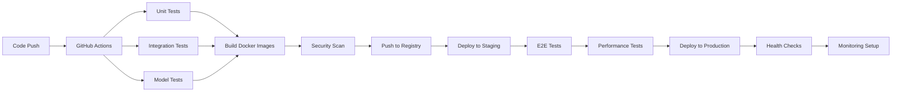

# Deployment Pipeline

## Overview

This document outlines the CI/CD pipeline and deployment strategies for our LLM-based movie recommendation system, ensuring reliable, scalable, and automated deployments across different environments.

## CI/CD Architecture

### Pipeline Overview


## GitHub Actions Workflows

### Main CI/CD Pipeline
```yaml
# .github/workflows/ci-cd.yml
name: CI/CD Pipeline

on:
  push:
    branches: [main, develop]
  pull_request:
    branches: [main]

env:
  REGISTRY: ghcr.io
  IMAGE_NAME: ${{ github.repository }}

jobs:
  test:
    runs-on: ubuntu-latest
    strategy:
      matrix:
        python-version: [3.11]
    
    steps:
    - uses: actions/checkout@v4
    
    - name: Set up Python
      uses: actions/setup-python@v4
      with:
        python-version: ${{ matrix.python-version }}
    
    - name: Cache dependencies
      uses: actions/cache@v3
      with:
        path: ~/.cache/pip
        key: ${{ runner.os }}-pip-${{ hashFiles('**/requirements.txt') }}
    
    - name: Install dependencies
      run: |
        python -m pip install --upgrade pip
        pip install -r requirements.txt
        pip install -r requirements-dev.txt
    
    - name: Run unit tests
      run: |
        pytest tests/unit/ -v --cov=src --cov-report=xml
    
    - name: Run integration tests
      run: |
        pytest tests/integration/ -v
    
    - name: Upload coverage reports
      uses: codecov/codecov-action@v3
      with:
        file: ./coverage.xml

  model-tests:
    runs-on: ubuntu-latest
    needs: test
    
    steps:
    - uses: actions/checkout@v4
    
    - name: Set up Python
      uses: actions/setup-python@v4
      with:
        python-version: 3.11
    
    - name: Install Ollama
      run: |
        curl -fsSL https://ollama.ai/install.sh | sh
        ollama serve &
        sleep 10
        ollama pull llama2:7b
    
    - name: Test model inference
      run: |
        python scripts/test_model_inference.py
    
    - name: Validate model outputs
      run: |
        python scripts/validate_model_outputs.py

  build-and-push:
    runs-on: ubuntu-latest
    needs: [test, model-tests]
    if: github.ref == 'refs/heads/main'
    
    permissions:
      contents: read
      packages: write
    
    steps:
    - uses: actions/checkout@v4
    
    - name: Log in to Container Registry
      uses: docker/login-action@v2
      with:
        registry: ${{ env.REGISTRY }}
        username: ${{ github.actor }}
        password: ${{ secrets.GITHUB_TOKEN }}
    
    - name: Extract metadata
      id: meta
      uses: docker/metadata-action@v4
      with:
        images: ${{ env.REGISTRY }}/${{ env.IMAGE_NAME }}
        tags: |
          type=ref,event=branch
          type=ref,event=pr
          type=sha,prefix={{branch}}-
    
    - name: Build and push API image
      uses: docker/build-push-action@v4
      with:
        context: .
        file: ./docker/Dockerfile.api
        push: true
        tags: ${{ steps.meta.outputs.tags }}
        labels: ${{ steps.meta.outputs.labels }}
    
    - name: Build and push training image
      uses: docker/build-push-action@v4
      with:
        context: .
        file: ./docker/Dockerfile.training
        push: true
        tags: ${{ env.REGISTRY }}/${{ env.IMAGE_NAME }}-training:${{ github.sha }}

  security-scan:
    runs-on: ubuntu-latest
    needs: build-and-push
    
    steps:
    - name: Run Trivy vulnerability scanner
      uses: aquasecurity/trivy-action@master
      with:
        image-ref: ${{ env.REGISTRY }}/${{ env.IMAGE_NAME }}:${{ github.sha }}
        format: 'sarif'
        output: 'trivy-results.sarif'
    
    - name: Upload Trivy scan results
      uses: github/codeql-action/upload-sarif@v2
      with:
        sarif_file: 'trivy-results.sarif'

  deploy-staging:
    runs-on: ubuntu-latest
    needs: [build-and-push, security-scan]
    environment: staging
    
    steps:
    - uses: actions/checkout@v4
    
    - name: Deploy to staging
      run: |
        echo "Deploying to staging environment..."
        # Add deployment commands here
        
    - name: Run E2E tests
      run: |
        python scripts/e2e_tests.py --environment=staging
    
    - name: Performance tests
      run: |
        python scripts/performance_tests.py --environment=staging

  deploy-production:
    runs-on: ubuntu-latest
    needs: deploy-staging
    environment: production
    if: github.ref == 'refs/heads/main'
    
    steps:
    - uses: actions/checkout@v4
    
    - name: Deploy to production
      run: |
        echo "Deploying to production environment..."
        # Add production deployment commands
    
    - name: Health checks
      run: |
        python scripts/health_checks.py --environment=production
```

### Model Training Pipeline
```yaml
# .github/workflows/model-training.yml
name: Model Training Pipeline

on:
  schedule:
    - cron: '0 2 * * 0'  # Weekly on Sunday at 2 AM
  workflow_dispatch:
    inputs:
      model_version:
        description: 'Model version to train'
        required: true
        default: 'v1.0'

jobs:
  train-model:
    runs-on: self-hosted  # Use GPU-enabled runner
    
    steps:
    - uses: actions/checkout@v4
    
    - name: Set up Python
      uses: actions/setup-python@v4
      with:
        python-version: 3.11
    
    - name: Install dependencies
      run: |
        pip install -r requirements.txt
        pip install -r requirements-training.txt
    
    - name: Download training data
      run: |
        python scripts/download_data.py --dataset=movielens-25m
    
    - name: Preprocess data
      run: |
        python scripts/preprocess_data.py
    
    - name: Train model
      run: |
        python scripts/train_model.py --version=${{ github.event.inputs.model_version }}
    
    - name: Evaluate model
      run: |
        python scripts/evaluate_model.py --version=${{ github.event.inputs.model_version }}
    
    - name: Upload model artifacts
      uses: actions/upload-artifact@v3
      with:
        name: model-${{ github.event.inputs.model_version }}
        path: models/
    
    - name: Deploy to Ollama
      run: |
        python scripts/deploy_to_ollama.py --version=${{ github.event.inputs.model_version }}
```

## Deployment Strategies

### Blue-Green Deployment
```python
# scripts/blue_green_deployment.py
import subprocess
import time
import requests
from typing import Dict, Any

class BlueGreenDeployment:
    def __init__(self, config: Dict[str, Any]):
        self.config = config
        self.current_env = self.get_current_environment()
        self.target_env = 'green' if self.current_env == 'blue' else 'blue'
    
    def deploy(self, image_tag: str) -> bool:
        """Execute blue-green deployment."""
        
        try:
            # 1. Deploy to target environment
            self.deploy_to_environment(self.target_env, image_tag)
            
            # 2. Health checks
            if not self.health_check(self.target_env):
                raise Exception("Health checks failed")
            
            # 3. Smoke tests
            if not self.smoke_tests(self.target_env):
                raise Exception("Smoke tests failed")
            
            # 4. Switch traffic
            self.switch_traffic(self.target_env)
            
            # 5. Final verification
            if not self.verify_deployment():
                self.rollback()
                return False
            
            # 6. Cleanup old environment
            self.cleanup_old_environment(self.current_env)
            
            return True
            
        except Exception as e:
            print(f"Deployment failed: {e}")
            self.rollback()
            return False
    
    def deploy_to_environment(self, env: str, image_tag: str):
        """Deploy application to specific environment."""
        
        cmd = f"""
        docker-compose -f docker-compose.{env}.yml down
        docker-compose -f docker-compose.{env}.yml pull
        IMAGE_TAG={image_tag} docker-compose -f docker-compose.{env}.yml up -d
        """
        
        result = subprocess.run(cmd, shell=True, capture_output=True, text=True)
        if result.returncode != 0:
            raise Exception(f"Deployment failed: {result.stderr}")
    
    def health_check(self, env: str) -> bool:
        """Perform health checks on deployed environment."""
        
        health_url = f"{self.config[env]['base_url']}/health"
        
        for attempt in range(30):  # 5 minutes with 10s intervals
            try:
                response = requests.get(health_url, timeout=10)
                if response.status_code == 200:
                    return True
            except requests.RequestException:
                pass
            
            time.sleep(10)
        
        return False
    
    def smoke_tests(self, env: str) -> bool:
        """Run smoke tests against deployed environment."""
        
        base_url = self.config[env]['base_url']
        
        # Test recommendation endpoint
        test_payload = {
            "user_id": 1,
            "num_recommendations": 5
        }
        
        try:
            response = requests.post(
                f"{base_url}/recommend",
                json=test_payload,
                timeout=30
            )
            
            if response.status_code != 200:
                return False
            
            recommendations = response.json()
            return len(recommendations.get('movies', [])) == 5
            
        except requests.RequestException:
            return False
    
    def switch_traffic(self, target_env: str):
        """Switch load balancer traffic to target environment."""
        
        # Update load balancer configuration
        nginx_config = f"""
        upstream backend {{
            server {self.config[target_env]['host']}:{self.config[target_env]['port']};
        }}
        """
        
        with open('/etc/nginx/conf.d/upstream.conf', 'w') as f:
            f.write(nginx_config)
        
        # Reload nginx
        subprocess.run(['nginx', '-s', 'reload'])
```

### Canary Deployment
```python
# scripts/canary_deployment.py
class CanaryDeployment:
    def __init__(self, config: Dict[str, Any]):
        self.config = config
        self.traffic_percentages = [5, 10, 25, 50, 100]
    
    def deploy(self, image_tag: str) -> bool:
        """Execute canary deployment with gradual traffic increase."""
        
        try:
            # Deploy canary version
            self.deploy_canary(image_tag)
            
            # Gradually increase traffic
            for percentage in self.traffic_percentages:
                self.set_traffic_split(percentage)
                
                # Monitor metrics for 10 minutes
                if not self.monitor_metrics(duration=600):
                    self.rollback()
                    return False
                
                print(f"Canary at {percentage}% traffic - metrics look good")
            
            # Complete deployment
            self.complete_canary_deployment()
            return True
            
        except Exception as e:
            print(f"Canary deployment failed: {e}")
            self.rollback()
            return False
    
    def monitor_metrics(self, duration: int) -> bool:
        """Monitor key metrics during canary deployment."""
        
        metrics_to_check = [
            'error_rate',
            'response_time_p95',
            'recommendation_quality'
        ]
        
        for _ in range(duration // 30):  # Check every 30 seconds
            metrics = self.get_current_metrics()
            
            # Check error rate
            if metrics['error_rate'] > self.config['thresholds']['max_error_rate']:
                return False
            
            # Check response time
            if metrics['response_time_p95'] > self.config['thresholds']['max_response_time']:
                return False
            
            # Check recommendation quality
            if metrics['recommendation_quality'] < self.config['thresholds']['min_quality_score']:
                return False
            
            time.sleep(30)
        
        return True
```

## Infrastructure as Code

### Terraform Configuration
```hcl
# infrastructure/main.tf
provider "aws" {
  region = var.aws_region
}

# ECS Cluster
resource "aws_ecs_cluster" "recommendation_cluster" {
  name = "movie-recommendation-cluster"
  
  setting {
    name  = "containerInsights"
    value = "enabled"
  }
}

# Application Load Balancer
resource "aws_lb" "recommendation_alb" {
  name               = "recommendation-alb"
  internal           = false
  load_balancer_type = "application"
  security_groups    = [aws_security_group.alb_sg.id]
  subnets           = var.public_subnet_ids
  
  enable_deletion_protection = false
}

# ECS Service
resource "aws_ecs_service" "recommendation_service" {
  name            = "recommendation-service"
  cluster         = aws_ecs_cluster.recommendation_cluster.id
  task_definition = aws_ecs_task_definition.recommendation_task.arn
  desired_count   = var.desired_count
  
  load_balancer {
    target_group_arn = aws_lb_target_group.recommendation_tg.arn
    container_name   = "recommendation-api"
    container_port   = 8000
  }
  
  deployment_configuration {
    maximum_percent         = 200
    minimum_healthy_percent = 100
  }
}

# Auto Scaling
resource "aws_appautoscaling_target" "recommendation_target" {
  max_capacity       = 10
  min_capacity       = 2
  resource_id        = "service/${aws_ecs_cluster.recommendation_cluster.name}/${aws_ecs_service.recommendation_service.name}"
  scalable_dimension = "ecs:service:DesiredCount"
  service_namespace  = "ecs"
}

resource "aws_appautoscaling_policy" "recommendation_scale_up" {
  name               = "recommendation-scale-up"
  policy_type        = "TargetTrackingScaling"
  resource_id        = aws_appautoscaling_target.recommendation_target.resource_id
  scalable_dimension = aws_appautoscaling_target.recommendation_target.scalable_dimension
  service_namespace  = aws_appautoscaling_target.recommendation_target.service_namespace
  
  target_tracking_scaling_policy_configuration {
    predefined_metric_specification {
      predefined_metric_type = "ECSServiceAverageCPUUtilization"
    }
    target_value = 70.0
  }
}
```

### Kubernetes Deployment
```yaml
# k8s/deployment.yaml
apiVersion: apps/v1
kind: Deployment
metadata:
  name: recommendation-api
  labels:
    app: recommendation-api
spec:
  replicas: 3
  selector:
    matchLabels:
      app: recommendation-api
  template:
    metadata:
      labels:
        app: recommendation-api
    spec:
      containers:
      - name: api
        image: ghcr.io/your-org/movie-recommender:latest
        ports:
        - containerPort: 8000
        env:
        - name: DATABASE_URL
          valueFrom:
            secretKeyRef:
              name: db-secret
              key: url
        - name: REDIS_URL
          valueFrom:
            secretKeyRef:
              name: redis-secret
              key: url
        resources:
          requests:
            memory: "512Mi"
            cpu: "250m"
          limits:
            memory: "1Gi"
            cpu: "500m"
        livenessProbe:
          httpGet:
            path: /health
            port: 8000
          initialDelaySeconds: 30
          periodSeconds: 10
        readinessProbe:
          httpGet:
            path: /ready
            port: 8000
          initialDelaySeconds: 5
          periodSeconds: 5

---
apiVersion: v1
kind: Service
metadata:
  name: recommendation-api-service
spec:
  selector:
    app: recommendation-api
  ports:
  - protocol: TCP
    port: 80
    targetPort: 8000
  type: LoadBalancer

---
apiVersion: autoscaling/v2
kind: HorizontalPodAutoscaler
metadata:
  name: recommendation-api-hpa
spec:
  scaleTargetRef:
    apiVersion: apps/v1
    kind: Deployment
    name: recommendation-api
  minReplicas: 2
  maxReplicas: 10
  metrics:
  - type: Resource
    resource:
      name: cpu
      target:
        type: Utilization
        averageUtilization: 70
  - type: Resource
    resource:
      name: memory
      target:
        type: Utilization
        averageUtilization: 80
```

## Monitoring and Alerting

### Deployment Monitoring
```python
# scripts/deployment_monitor.py
import time
import requests
from datadog import initialize, api
from typing import Dict, List

class DeploymentMonitor:
    def __init__(self, config: Dict):
        self.config = config
        initialize(**config['datadog'])
    
    def monitor_deployment(self, deployment_id: str, duration: int = 1800):
        """Monitor deployment for specified duration."""
        
        start_time = time.time()
        alerts = []
        
        while time.time() - start_time < duration:
            metrics = self.collect_metrics()
            
            # Check for anomalies
            anomalies = self.detect_anomalies(metrics)
            if anomalies:
                alerts.extend(anomalies)
                self.send_alerts(anomalies, deployment_id)
            
            # Log metrics
            self.log_metrics(metrics, deployment_id)
            
            time.sleep(60)  # Check every minute
        
        return alerts
    
    def collect_metrics(self) -> Dict:
        """Collect key deployment metrics."""
        
        return {
            'error_rate': self.get_error_rate(),
            'response_time': self.get_response_time(),
            'throughput': self.get_throughput(),
            'cpu_usage': self.get_cpu_usage(),
            'memory_usage': self.get_memory_usage()
        }
    
    def detect_anomalies(self, metrics: Dict) -> List[Dict]:
        """Detect anomalies in metrics."""
        
        anomalies = []
        
        # Error rate threshold
        if metrics['error_rate'] > self.config['thresholds']['error_rate']:
            anomalies.append({
                'type': 'high_error_rate',
                'value': metrics['error_rate'],
                'threshold': self.config['thresholds']['error_rate']
            })
        
        # Response time threshold
        if metrics['response_time'] > self.config['thresholds']['response_time']:
            anomalies.append({
                'type': 'high_response_time',
                'value': metrics['response_time'],
                'threshold': self.config['thresholds']['response_time']
            })
        
        return anomalies
```

## Rollback Strategies

### Automated Rollback
```python
# scripts/rollback.py
class AutomatedRollback:
    def __init__(self, config: Dict):
        self.config = config
    
    def execute_rollback(self, previous_version: str) -> bool:
        """Execute automated rollback to previous version."""
        
        try:
            # 1. Stop current deployment
            self.stop_current_deployment()
            
            # 2. Deploy previous version
            self.deploy_version(previous_version)
            
            # 3. Verify rollback
            if self.verify_rollback():
                self.notify_rollback_success(previous_version)
                return True
            else:
                raise Exception("Rollback verification failed")
                
        except Exception as e:
            self.notify_rollback_failure(str(e))
            return False
    
    def stop_current_deployment(self):
        """Stop current deployment gracefully."""
        
        cmd = "kubectl rollout undo deployment/recommendation-api"
        result = subprocess.run(cmd, shell=True, capture_output=True, text=True)
        
        if result.returncode != 0:
            raise Exception(f"Failed to rollback: {result.stderr}")
```

## Next Steps

1. **Advanced Deployment**: Implement progressive delivery with Flagger
2. **Multi-Region**: Set up multi-region deployment strategy
3. **Disaster Recovery**: Implement comprehensive DR procedures
4. **Cost Optimization**: Add cost monitoring and optimization
5. **Security Hardening**: Implement additional security measures

This deployment pipeline ensures reliable, automated, and monitored deployments of our recommendation system.
