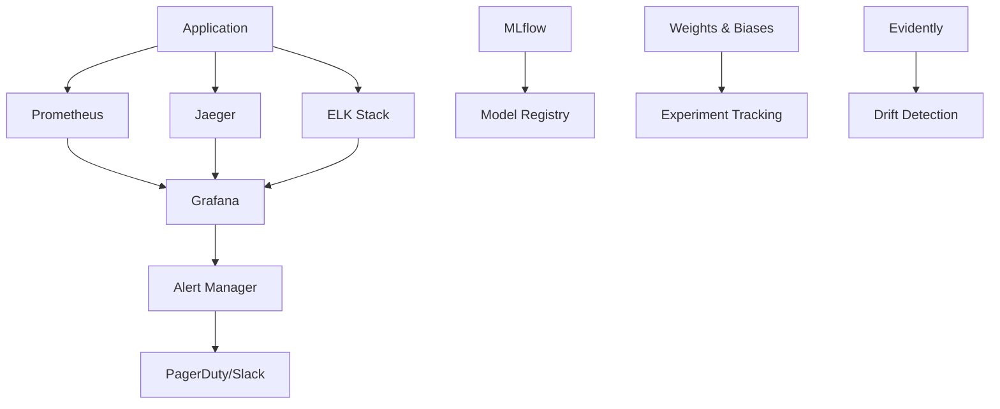

# Monitoring and Observability

## Overview

This document outlines the comprehensive monitoring and observability strategy for our LLM-based movie recommendation system, covering MLOps tools, performance monitoring, model drift detection, and optimization techniques.

## Monitoring Architecture

### Three Pillars of Observability
1. **Metrics**: Quantitative measurements of system behavior
2. **Logs**: Detailed records of system events and errors
3. **Traces**: Request flow through distributed system components

### Monitoring Stack


## MLOps Monitoring

### MLflow Integration
```python
# src/monitoring/mlflow_tracker.py
import mlflow
import mlflow.pytorch
from typing import Dict, Any, Optional
import numpy as np
from datetime import datetime

class MLflowTracker:
    def __init__(self, tracking_uri: str, experiment_name: str):
        mlflow.set_tracking_uri(tracking_uri)
        mlflow.set_experiment(experiment_name)
        self.run_id = None
    
    def start_run(self, run_name: Optional[str] = None) -> str:
        """Start a new MLflow run."""
        run = mlflow.start_run(run_name=run_name)
        self.run_id = run.info.run_id
        return self.run_id
    
    def log_model_metrics(self, metrics: Dict[str, float], step: Optional[int] = None):
        """Log model performance metrics."""
        for metric_name, value in metrics.items():
            mlflow.log_metric(metric_name, value, step=step)
    
    def log_model_parameters(self, params: Dict[str, Any]):
        """Log model hyperparameters."""
        mlflow.log_params(params)
    
    def log_model_artifacts(self, model_path: str, model_name: str = "recommendation_model"):
        """Log model artifacts."""
        mlflow.pytorch.log_model(
            pytorch_model=model_path,
            artifact_path=model_name,
            registered_model_name=model_name
        )
    
    def log_dataset_info(self, dataset_info: Dict[str, Any]):
        """Log dataset information and statistics."""
        mlflow.log_params({
            f"dataset_{key}": value for key, value in dataset_info.items()
        })
    
    def log_recommendation_quality(self, predictions: np.ndarray, 
                                 actual: np.ndarray, user_ids: np.ndarray):
        """Log recommendation quality metrics."""
        from sklearn.metrics import mean_squared_error, mean_absolute_error
        
        metrics = {
            'rmse': np.sqrt(mean_squared_error(actual, predictions)),
            'mae': mean_absolute_error(actual, predictions),
            'prediction_variance': np.var(predictions),
            'coverage': len(np.unique(predictions)) / len(predictions)
        }
        
        self.log_model_metrics(metrics)
        
        # Log prediction distribution
        mlflow.log_histogram_3d(
            predictions, 
            bins=20, 
            title="Prediction Distribution"
        )
    
    def end_run(self):
        """End current MLflow run."""
        mlflow.end_run()

# Usage example
def track_training_run(model, train_data, val_data, hyperparams):
    """Track a complete training run."""
    
    tracker = MLflowTracker("http://mlflow:5000", "movie-recommendation")
    
    with tracker.start_run(f"training_{datetime.now().strftime('%Y%m%d_%H%M%S')}"):
        # Log hyperparameters
        tracker.log_model_parameters(hyperparams)
        
        # Log dataset info
        dataset_info = {
            'train_size': len(train_data),
            'val_size': len(val_data),
            'num_users': train_data['userId'].nunique(),
            'num_movies': train_data['movieId'].nunique()
        }
        tracker.log_dataset_info(dataset_info)
        
        # Training loop with metric logging
        for epoch in range(hyperparams['num_epochs']):
            train_loss = train_epoch(model, train_data)
            val_loss = validate_epoch(model, val_data)
            
            tracker.log_model_metrics({
                'train_loss': train_loss,
                'val_loss': val_loss
            }, step=epoch)
        
        # Log final model
        tracker.log_model_artifacts(model, "lora_recommendation_model")
```

### Weights & Biases Integration
```python
# src/monitoring/wandb_tracker.py
import wandb
from typing import Dict, Any, Optional
import numpy as np
import matplotlib.pyplot as plt

class WandBTracker:
    def __init__(self, project_name: str, config: Dict[str, Any]):
        self.run = wandb.init(
            project=project_name,
            config=config,
            tags=["recommendation", "llm", "lora"]
        )
    
    def log_metrics(self, metrics: Dict[str, float], step: Optional[int] = None):
        """Log metrics to Weights & Biases."""
        wandb.log(metrics, step=step)
    
    def log_model_performance(self, predictions: np.ndarray, 
                            actual: np.ndarray, epoch: int):
        """Log comprehensive model performance metrics."""
        
        # Calculate metrics
        mse = np.mean((predictions - actual) ** 2)
        mae = np.mean(np.abs(predictions - actual))
        
        # Create visualizations
        fig, axes = plt.subplots(2, 2, figsize=(12, 10))
        
        # Prediction vs Actual scatter plot
        axes[0, 0].scatter(actual, predictions, alpha=0.5)
        axes[0, 0].plot([actual.min(), actual.max()], [actual.min(), actual.max()], 'r--')
        axes[0, 0].set_xlabel('Actual Ratings')
        axes[0, 0].set_ylabel('Predicted Ratings')
        axes[0, 0].set_title('Predictions vs Actual')
        
        # Residuals plot
        residuals = predictions - actual
        axes[0, 1].scatter(predictions, residuals, alpha=0.5)
        axes[0, 1].axhline(y=0, color='r', linestyle='--')
        axes[0, 1].set_xlabel('Predicted Ratings')
        axes[0, 1].set_ylabel('Residuals')
        axes[0, 1].set_title('Residuals Plot')
        
        # Distribution of predictions
        axes[1, 0].hist(predictions, bins=20, alpha=0.7, label='Predictions')
        axes[1, 0].hist(actual, bins=20, alpha=0.7, label='Actual')
        axes[1, 0].set_xlabel('Rating')
        axes[1, 0].set_ylabel('Frequency')
        axes[1, 0].set_title('Rating Distributions')
        axes[1, 0].legend()
        
        # Error distribution
        axes[1, 1].hist(residuals, bins=20, alpha=0.7)
        axes[1, 1].set_xlabel('Prediction Error')
        axes[1, 1].set_ylabel('Frequency')
        axes[1, 1].set_title('Error Distribution')
        
        plt.tight_layout()
        
        # Log to wandb
        wandb.log({
            'mse': mse,
            'mae': mae,
            'model_performance': wandb.Image(fig),
            'epoch': epoch
        })
        
        plt.close(fig)
    
    def log_recommendation_diversity(self, recommendations: Dict[int, list], epoch: int):
        """Log recommendation diversity metrics."""
        
        # Calculate diversity metrics
        all_recommendations = [item for recs in recommendations.values() for item in recs]
        unique_items = len(set(all_recommendations))
        total_items = len(all_recommendations)
        
        diversity_score = unique_items / total_items if total_items > 0 else 0
        
        # Genre diversity
        genre_counts = {}
        for recs in recommendations.values():
            for movie_id in recs:
                # Get movie genres (implement based on your data structure)
                genres = get_movie_genres(movie_id)
                for genre in genres:
                    genre_counts[genre] = genre_counts.get(genre, 0) + 1
        
        wandb.log({
            'recommendation_diversity': diversity_score,
            'unique_recommendations': unique_items,
            'total_recommendations': total_items,
            'genre_distribution': genre_counts,
            'epoch': epoch
        })
    
    def finish(self):
        """Finish the wandb run."""
        wandb.finish()
```

## Model Drift Detection

### Evidently AI Integration
```python
# src/monitoring/drift_detector.py
from evidently import ColumnMapping
from evidently.report import Report
from evidently.metric_preset import DataDriftPreset, TargetDriftPreset
from evidently.test_suite import TestSuite
from evidently.tests import *
import pandas as pd
from typing import Dict, Any, Optional
import json

class DriftDetector:
    def __init__(self, reference_data: pd.DataFrame, 
                 target_column: str = 'rating'):
        self.reference_data = reference_data
        self.target_column = target_column
        self.column_mapping = ColumnMapping(
            target=target_column,
            prediction='predicted_rating',
            numerical_features=['avg_rating', 'rating_count', 'popularity_score'],
            categorical_features=['genres', 'user_type']
        )
    
    def detect_data_drift(self, current_data: pd.DataFrame) -> Dict[str, Any]:
        """Detect data drift between reference and current data."""
        
        # Create drift report
        data_drift_report = Report(metrics=[DataDriftPreset()])
        data_drift_report.run(
            reference_data=self.reference_data,
            current_data=current_data,
            column_mapping=self.column_mapping
        )
        
        # Extract drift results
        drift_results = data_drift_report.as_dict()
        
        return {
            'drift_detected': drift_results['metrics'][0]['result']['dataset_drift'],
            'drift_score': drift_results['metrics'][0]['result']['drift_score'],
            'drifted_features': [
                feature['feature_name'] 
                for feature in drift_results['metrics'][0]['result']['drift_by_columns'].values()
                if feature['drift_detected']
            ]
        }
    
    def detect_target_drift(self, current_data: pd.DataFrame) -> Dict[str, Any]:
        """Detect target drift in model predictions."""
        
        target_drift_report = Report(metrics=[TargetDriftPreset()])
        target_drift_report.run(
            reference_data=self.reference_data,
            current_data=current_data,
            column_mapping=self.column_mapping
        )
        
        drift_results = target_drift_report.as_dict()
        
        return {
            'target_drift_detected': drift_results['metrics'][0]['result']['drift_detected'],
            'target_drift_score': drift_results['metrics'][0]['result']['drift_score']
        }
    
    def run_drift_tests(self, current_data: pd.DataFrame) -> Dict[str, Any]:
        """Run comprehensive drift test suite."""
        
        tests = TestSuite(tests=[
            TestNumberOfColumnsWithMissingValues(),
            TestNumberOfRowsWithMissingValues(),
            TestNumberOfConstantColumns(),
            TestNumberOfDuplicatedRows(),
            TestNumberOfDuplicatedColumns(),
            TestColumnsType(),
            TestNumberOfDriftedColumns(),
        ])
        
        tests.run(
            reference_data=self.reference_data,
            current_data=current_data,
            column_mapping=self.column_mapping
        )
        
        return tests.as_dict()
    
    def generate_drift_report(self, current_data: pd.DataFrame, 
                            output_path: str = "drift_report.html"):
        """Generate comprehensive HTML drift report."""
        
        report = Report(metrics=[
            DataDriftPreset(),
            TargetDriftPreset()
        ])
        
        report.run(
            reference_data=self.reference_data,
            current_data=current_data,
            column_mapping=self.column_mapping
        )
        
        report.save_html(output_path)
        return output_path

# Automated drift monitoring
class DriftMonitor:
    def __init__(self, drift_detector: DriftDetector, 
                 alert_threshold: float = 0.5):
        self.drift_detector = drift_detector
        self.alert_threshold = alert_threshold
    
    def monitor_drift(self, current_data: pd.DataFrame) -> Dict[str, Any]:
        """Monitor for drift and trigger alerts if necessary."""
        
        # Detect data drift
        data_drift = self.drift_detector.detect_data_drift(current_data)
        target_drift = self.drift_detector.detect_target_drift(current_data)
        
        # Check if drift exceeds threshold
        drift_alert = (
            data_drift['drift_score'] > self.alert_threshold or
            target_drift['target_drift_score'] > self.alert_threshold
        )
        
        if drift_alert:
            self.send_drift_alert(data_drift, target_drift)
        
        return {
            'data_drift': data_drift,
            'target_drift': target_drift,
            'alert_triggered': drift_alert
        }
    
    def send_drift_alert(self, data_drift: Dict, target_drift: Dict):
        """Send drift alert to monitoring system."""
        
        alert_message = f"""
        🚨 Model Drift Alert 🚨
        
        Data Drift Score: {data_drift['drift_score']:.3f}
        Target Drift Score: {target_drift['target_drift_score']:.3f}
        
        Drifted Features: {', '.join(data_drift['drifted_features'])}
        
        Action Required: Review model performance and consider retraining.
        """
        
        # Send to Slack/Teams/Email (implement based on your setup)
        self.send_notification(alert_message)
```

## Performance Monitoring

### Application Metrics
```python
# src/monitoring/performance_monitor.py
from prometheus_client import Counter, Histogram, Gauge, start_http_server
import time
from functools import wraps
from typing import Callable, Any
import psutil
import GPUtil

# Prometheus metrics
REQUEST_COUNT = Counter('recommendation_requests_total', 'Total recommendation requests', ['method', 'endpoint'])
REQUEST_LATENCY = Histogram('recommendation_request_duration_seconds', 'Request latency')
ACTIVE_USERS = Gauge('recommendation_active_users', 'Number of active users')
MODEL_INFERENCE_TIME = Histogram('model_inference_duration_seconds', 'Model inference time')
RECOMMENDATION_QUALITY = Gauge('recommendation_quality_score', 'Average recommendation quality score')

# System metrics
CPU_USAGE = Gauge('system_cpu_usage_percent', 'CPU usage percentage')
MEMORY_USAGE = Gauge('system_memory_usage_percent', 'Memory usage percentage')
GPU_USAGE = Gauge('gpu_usage_percent', 'GPU usage percentage')
GPU_MEMORY = Gauge('gpu_memory_usage_percent', 'GPU memory usage percentage')

class PerformanceMonitor:
    def __init__(self, port: int = 8001):
        self.port = port
        start_http_server(port)
    
    def track_request(self, method: str, endpoint: str):
        """Decorator to track request metrics."""
        def decorator(func: Callable) -> Callable:
            @wraps(func)
            def wrapper(*args, **kwargs) -> Any:
                start_time = time.time()
                
                try:
                    result = func(*args, **kwargs)
                    REQUEST_COUNT.labels(method=method, endpoint=endpoint).inc()
                    return result
                finally:
                    REQUEST_LATENCY.observe(time.time() - start_time)
                    
            return wrapper
        return decorator
    
    def track_model_inference(self, func: Callable) -> Callable:
        """Decorator to track model inference time."""
        @wraps(func)
        def wrapper(*args, **kwargs) -> Any:
            start_time = time.time()
            result = func(*args, **kwargs)
            MODEL_INFERENCE_TIME.observe(time.time() - start_time)
            return result
        return wrapper
    
    def update_system_metrics(self):
        """Update system resource metrics."""
        # CPU and Memory
        CPU_USAGE.set(psutil.cpu_percent())
        MEMORY_USAGE.set(psutil.virtual_memory().percent)
        
        # GPU metrics (if available)
        try:
            gpus = GPUtil.getGPUs()
            if gpus:
                gpu = gpus[0]  # Use first GPU
                GPU_USAGE.set(gpu.load * 100)
                GPU_MEMORY.set(gpu.memoryUtil * 100)
        except:
            pass
    
    def update_recommendation_quality(self, quality_score: float):
        """Update recommendation quality metric."""
        RECOMMENDATION_QUALITY.set(quality_score)
    
    def update_active_users(self, count: int):
        """Update active users metric."""
        ACTIVE_USERS.set(count)

# Usage in FastAPI application
monitor = PerformanceMonitor()

@monitor.track_request('POST', '/recommend')
async def get_recommendations(user_id: int):
    # Your recommendation logic here
    pass

@monitor.track_model_inference
def model_inference(input_data):
    # Your model inference logic here
    pass
```

### Custom Metrics Dashboard
```python
# src/monitoring/dashboard.py
import streamlit as st
import plotly.graph_objects as go
import plotly.express as px
import pandas as pd
from datetime import datetime, timedelta
import requests

class MonitoringDashboard:
    def __init__(self, prometheus_url: str = "http://prometheus:9090"):
        self.prometheus_url = prometheus_url
    
    def query_prometheus(self, query: str, start_time: datetime, end_time: datetime):
        """Query Prometheus for metrics data."""
        
        params = {
            'query': query,
            'start': start_time.isoformat(),
            'end': end_time.isoformat(),
            'step': '1m'
        }
        
        response = requests.get(f"{self.prometheus_url}/api/v1/query_range", params=params)
        return response.json()
    
    def create_dashboard(self):
        """Create Streamlit monitoring dashboard."""
        
        st.title("🎬 Movie Recommendation System Monitoring")
        
        # Time range selector
        col1, col2 = st.columns(2)
        with col1:
            start_time = st.datetime_input("Start Time", datetime.now() - timedelta(hours=24))
        with col2:
            end_time = st.datetime_input("End Time", datetime.now())
        
        # Key metrics
        st.header("📊 Key Metrics")
        
        col1, col2, col3, col4 = st.columns(4)
        
        with col1:
            # Request rate
            request_rate = self.get_request_rate(start_time, end_time)
            st.metric("Requests/min", f"{request_rate:.1f}")
        
        with col2:
            # Average response time
            avg_response_time = self.get_avg_response_time(start_time, end_time)
            st.metric("Avg Response Time", f"{avg_response_time:.2f}s")
        
        with col3:
            # Error rate
            error_rate = self.get_error_rate(start_time, end_time)
            st.metric("Error Rate", f"{error_rate:.2f}%")
        
        with col4:
            # Active users
            active_users = self.get_active_users()
            st.metric("Active Users", active_users)
        
        # Performance charts
        st.header("📈 Performance Trends")
        
        # Response time chart
        response_time_data = self.query_prometheus(
            'recommendation_request_duration_seconds',
            start_time, end_time
        )
        
        if response_time_data['data']['result']:
            df = self.parse_prometheus_data(response_time_data)
            fig = px.line(df, x='timestamp', y='value', title='Response Time Trend')
            st.plotly_chart(fig, use_container_width=True)
        
        # System resources
        st.header("🖥️ System Resources")
        
        col1, col2 = st.columns(2)
        
        with col1:
            # CPU usage
            cpu_data = self.query_prometheus('system_cpu_usage_percent', start_time, end_time)
            if cpu_data['data']['result']:
                df = self.parse_prometheus_data(cpu_data)
                fig = px.line(df, x='timestamp', y='value', title='CPU Usage (%)')
                st.plotly_chart(fig, use_container_width=True)
        
        with col2:
            # Memory usage
            memory_data = self.query_prometheus('system_memory_usage_percent', start_time, end_time)
            if memory_data['data']['result']:
                df = self.parse_prometheus_data(memory_data)
                fig = px.line(df, x='timestamp', y='value', title='Memory Usage (%)')
                st.plotly_chart(fig, use_container_width=True)
        
        # Model performance
        st.header("🤖 Model Performance")
        
        # Recommendation quality
        quality_data = self.query_prometheus('recommendation_quality_score', start_time, end_time)
        if quality_data['data']['result']:
            df = self.parse_prometheus_data(quality_data)
            fig = px.line(df, x='timestamp', y='value', title='Recommendation Quality Score')
            st.plotly_chart(fig, use_container_width=True)
        
        # Model inference time
        inference_data = self.query_prometheus('model_inference_duration_seconds', start_time, end_time)
        if inference_data['data']['result']:
            df = self.parse_prometheus_data(inference_data)
            fig = px.histogram(df, x='value', title='Model Inference Time Distribution')
            st.plotly_chart(fig, use_container_width=True)
    
    def parse_prometheus_data(self, data: dict) -> pd.DataFrame:
        """Parse Prometheus query result into DataFrame."""
        
        records = []
        for result in data['data']['result']:
            for timestamp, value in result['values']:
                records.append({
                    'timestamp': datetime.fromtimestamp(timestamp),
                    'value': float(value)
                })
        
        return pd.DataFrame(records)

# Run dashboard
if __name__ == "__main__":
    dashboard = MonitoringDashboard()
    dashboard.create_dashboard()
```

## Alerting System

### Alert Configuration
```yaml
# config/alerts.yml
groups:
- name: recommendation_system_alerts
  rules:
  - alert: HighErrorRate
    expr: rate(recommendation_requests_total{status="error"}[5m]) > 0.05
    for: 2m
    labels:
      severity: warning
    annotations:
      summary: "High error rate detected"
      description: "Error rate is {{ $value }} errors per second"
  
  - alert: HighResponseTime
    expr: histogram_quantile(0.95, rate(recommendation_request_duration_seconds_bucket[5m])) > 2
    for: 5m
    labels:
      severity: warning
    annotations:
      summary: "High response time detected"
      description: "95th percentile response time is {{ $value }} seconds"
  
  - alert: ModelDriftDetected
    expr: recommendation_drift_score > 0.5
    for: 1m
    labels:
      severity: critical
    annotations:
      summary: "Model drift detected"
      description: "Model drift score is {{ $value }}"
  
  - alert: LowRecommendationQuality
    expr: recommendation_quality_score < 0.7
    for: 10m
    labels:
      severity: warning
    annotations:
      summary: "Low recommendation quality"
      description: "Recommendation quality score is {{ $value }}"
```

## Next Steps

1. **Advanced Analytics**: Implement user behavior analytics
2. **Real-time Monitoring**: Set up real-time alerting and dashboards
3. **Cost Monitoring**: Add cost tracking and optimization
4. **Security Monitoring**: Implement security event monitoring
5. **Business Metrics**: Track business KPIs and ROI metrics

This comprehensive monitoring strategy ensures optimal performance, reliability, and continuous improvement of our recommendation system.
